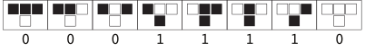

:title: Demo
:description: Demo of all editing features of the blosg
:year: 2025
:month: 7
:day: 26

This is a demo file for all features available.

# This is a title

Text can be *italic* (`*text*`), **bold** (`**text**`), or ***both*** (`***text***`)!

Inline code such as `this` is displayed by surround your text with a single back tick on each side `` `text` ``.

You can have inline code such as `def main()`. If you surround the inner code by '$' signs on both side then it renders `$\LaTeX$`. This formula `$E=mc^2$` relates the energy contained by an object with its mass.

## This is a secondary title

Links are also supported. Check out my [github](https://github.com/omaraflak). Use the following formatting `[title](https://example.com)`.

If no title is provided, then the link will be in preview mode `[](https://example.com)`:

[](https://github.com/omaraflak)

You can include images as well with ``:



The height and/or width of the image can be specified in pixels or percentage using the following syntax:

```md
 # height is 100px
 # width is 50% of the page
 # height is 200px and width is 200px
```

Use `---` for a horizontal line.

---

> Quotes need to start with `>`. It can extend multiple lines.
> Quotes need to start with `>`. It can extend multiple lines.
> Quotes need to start with `>`. It can extend multiple lines.

You can display code blocks by surround your code with 3 back ticks `` ``` `` before and after the code. Specify a language after the opening backticks to change the code highlighting.

```python
def multiply(a: int, b: int) -> int:
    return a * b
```

If the language specified is `latex`, i.e. `` ```latex ``, then the renderer will show `$\LaTeX$` in display mode.

```latex
(a+b)^n = \sum_{i=0}^n {n \choose k} a^k b^{n-k}
```

The renderer also supports Graphviz! Juse use `` ```dot `` for the opening code block.

```dot
digraph G {
    bgcolor="transparent"; // Keep background transparent

    // Graph attributes
    graph [
        labelloc="t" // Label at top
        fontname="Courier"
        fontsize=20
        rankdir="LR" // Left to Right layout
    ];

    // Node styles
    node [
        shape=box
        style=filled
        fontname="Courier"
        fontsize=12
    ];

    // Nodes with specific colors
    NodeA [label="Start Process" fillcolor="#FFDDC1" color="#FFA07A" fontcolor="#8B0000"]; // Light peach, salmon border, dark red text
    NodeB [label="Data Input" fillcolor="#D1FFD1" color="#3CB371" fontcolor="#006400"]; // Light green, medium sea green border, dark green text
    NodeC [label="Processing" fillcolor="#C1D1FF" color="#6A5ACD" fontcolor="#191970"]; // Light blue, slate blue border, midnight blue text
    NodeD [label="Validation" fillcolor="#FFFFC1" color="#FFD700" fontcolor="#B8860B"]; // Light yellow, gold border, dark goldenrod text
    NodeE [label="Output Result" fillcolor="#FFC1FF" color="#DA70D6" fontcolor="#800080"]; // Light magenta, orchid border, purple text
    NodeF [label="Error Handling" fillcolor="#FFC1C1" color="#DC143C" fontcolor="#8B0000" shape=ellipse]; // Light red, crimson border, dark red text, ellipse shape

    // Edges with specific colors and styles
    NodeA -> NodeB [label="Initialize" color="#4682B4" penwidth=2]; // Steel blue
    NodeB -> NodeC [label="Process Data" color="#2E8B57" style=dashed]; // Sea green, dashed
    NodeC -> NodeD [label="Validate" color="#8A2BE2" penwidth=1.5]; // Blue violet
    NodeD -> NodeE [label="Success" color="#008000" style=bold]; // Green, bold
    NodeD -> NodeF [label="Failure" color="#FF0000" style=dotted]; // Red, dotted
    NodeE -> NodeA [label="Loop Back" color="#FF4500" arrowhead=vee]; // Orange red, vee arrowhead
    NodeF -> NodeA [label="Retry" color="#8B4513" style=dotted]; // Saddle brown, dotted
}
```



# GitHub


```python
import numpy as np
import matplotlib.pyplot as plt

N = 100         # in how much sub pieces we should break a 1sec interval
T = 15          # total duration of the simulation
dt = 1 / N      # dt
g = 9.81        # acceleration of gravity
L = 1           # pendulum rope length
k = 0.8         # air resistance coefficient
m = 1           # mass of the pendulum

theta = [np.pi / 2]     # initial angle
theta_dot = [0]         # initial angular velocity
t = [0]

for i in range(N * T):
    theta_dot.append(theta_dot[-1] - theta_dot[-1] * dt * k / m - np.sin(theta[-1]) * dt * g / L)
    theta.append(theta_dot[-1] * dt + theta[-1])
    t.append((i + 1) * dt)

plt.plot(t, theta, label='theta')
plt.plot(t, theta_dot, label='theta dot')
plt.legend()
plt.show()
```

## Custom HTML & JS

You can put HTML tags and render something completely custom too.

<div id="plotDiv" style="width: 100%"></div>
<script src="https://cdnjs.cloudflare.com/ajax/libs/plotly.js/1.33.1/plotly.min.js" integrity="sha512-V0j9LhrK9IMNdFYZqh+IqU4cjo7wdxyHNyH+L0td4HryBuZ7Oq6QxP2/CWr6TituX31+gv5PnolvERuTbz8UNA==" crossorigin="anonymous" referrerpolicy="no-referrer"></script>
<script src="../scripts/demo.js"></script>