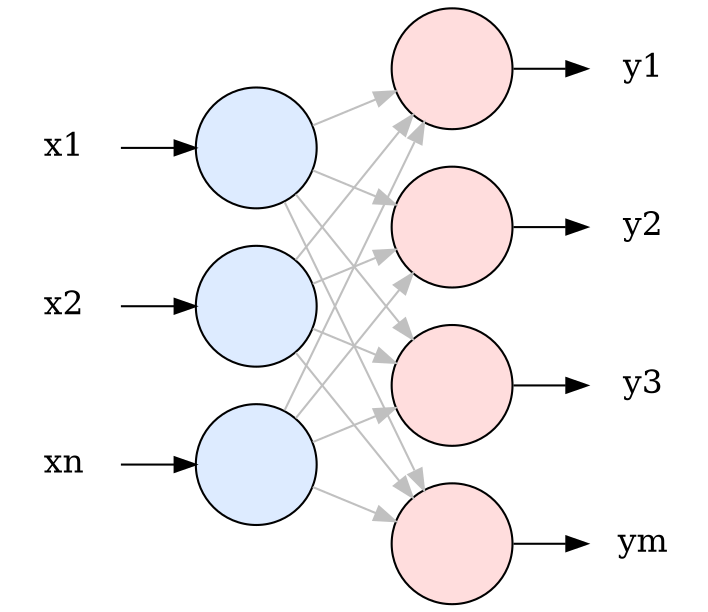
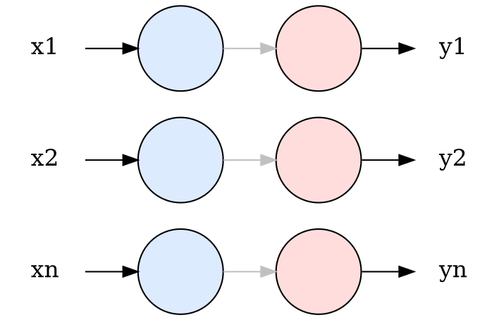

:title: Neural Network From Scratch
:description: Build your own machine learning library in Python.
:year: 2018
:month: 11
:day: 15
:updated_year: 2025
:updated_month: 8
:updated_day: 3
:pinned: true
:math: true
:code: true
:dot: true

In this post we will go through the mathematics of neural networks and code from scratch, in Python, a small modular library to build and train such models. The only import we'll ever need is NumPy for dealing with n-dimensional arrays:

```python
import numpy as np
```

I will assume you already have some knowledge about neural networks. The purpose here is not to explain *why*, but *how*.

You can find the entire code of the article on my GitHub:

[](https://github.com/omaraflak/neural-network-from-scratch)

# Preamble

A neural network is nothing but a mathematical function. It's a function with generally many *parameters* which can be tweaked to change the behavior of that function. For example:

```latex
f(x) = ax+b
```

This is the equation of a line, where `$a$` and `$b$` are the parameters that will determine which line exactly this equation represents. In the same way, a neural network is a very generic function that maps `$n$` inputs to `$m$` outputs and has some number of parameters, usually denoted as `$W$`, for *weights*.

```latex
\begin{align*}
f_W: \quad &\R^n \rightarrow \R^m \\
&x \mapsto f_W(x)
\end{align*}
```

Those weights determine what the function does. A certain set of `$W$` will make the function turn an image of a cat or dog (images are just pixels, which are just numbers) into a label 0 for cats and a label 1 for dogs. Another set of `$W$` could make the function predict the next word in a sentence, etc.

So it's really a matter of finding the `$W$` that makes the function behave the way you want. For this, we need 2 things: math and data.

In a nutshell, the idea is to define some ***loss function*** that evaluates how bad the network prediction is compared to what you really wanted, and then try to minimize that function using [Gradient Descent](https://en.wikipedia.org/wiki/Gradient_descent).

In pseudo-Python code, that would be:

```python
for _ in range(1000):
    y_pred = f(x, weights) # predict output from input
    error = loss(y_true, y_pred) # compute loss between actual output and desired output
    weights_gradient = error.gradient_wrt(weights) # compute derivative of error with respect to weights
    weights -= learning_rate * weights_gradient # update weights such that error is minimized (gradient descent)
```

# Layer by Layer

Our neural network `$f_W$` is usually a composition of many other small functions, i.e. `$f_W = f_1(f_2(f_3(x)))$`, each with its own set of parameters.

Those intermediate `$f_1$`, `$f_2$`, `$f_3$` functions are what we call ***layers***. Since they're a fundamental building block of neural network, we want to model them properly using an abstract class.

## Forward Propagation

All layers must be able to return an output, given a certain input:

```latex
X \rightarrow \boxed{\text{Layer}} \rightarrow Y
```

We can already emphasize one important point which is: since our neural network is a composition of functions, the output of one layer is the input of the next one.

```latex
X \rightarrow \boxed{\text{Layer 1}} \rightarrow H_1 \rightarrow \boxed{\text{Layer 2}} \rightarrow H_2 \rightarrow \boxed{\text{Layer 3}} \rightarrow Y \rightarrow E(Y^*, Y)
```

## Backward Propagation

Remember that once the forward propagation is complete and we have calculated `$E(Y^*, Y)$`, we need each layer to update its parameters. This can only be done if each layer can compute `$\frac{\partial E}{\partial W}$` if `$W$` is the set of parameters of that layer.

Therefore, during backward propagation, when want a layer to be able to return `$\frac{\partial E}{\partial X}$` given `$\frac{\partial E}{\partial W}$`:

```latex
\frac{\partial E}{\partial X} \leftarrow \boxed{\text{Layer}} \leftarrow \frac{\partial E}{\partial Y}
```

Here, I'm abusing the notation of derivatives, because we normally derive with respect to a variable, not a vector. However `$X \in \R^n$` and `$Y \in \R^m$`. This notation should be read as:

```latex
\frac{\partial E}{\partial X} =
\begin{bmatrix}
\dfrac{\partial E}{\partial x_1} \\[3ex]
\dfrac{\partial E}{\partial x_2} \\[3ex]
\vdots \\[3ex]
\dfrac{\partial E}{\partial x_n}
\end{bmatrix}
```

> Why do we want the layer to map `$\frac{\partial E}{\partial Y}$` to `$\frac{\partial E}{\partial X}$` ?

Forget about `$\frac{\partial E}{\partial X}$` for now. The reason we want this, is that if we have access to `$\frac{\partial E}{\partial Y}$` then we can very easily calculate `$\frac{\partial E}{\partial W}$` (for gradient descent) without knowing anything about the network architecture! We simply use the chain rule:

```latex
\frac{\partial E}{\partial W} = \frac{\partial E}{\partial Y} \frac{\partial Y}{\partial W}
```

Another abuse of notation... What I really mean is:

```latex
\frac{\partial E}{\partial w} = \sum_i \frac{\partial E}{\partial y_i} \frac{\partial y_i}{\partial w}
```

Since `$\frac{\partial E}{\partial y_i}$` would be given, the layer simply needs to calculate `$\frac{\partial y_i}{\partial w}$` which it knows how to, since for the layer: `$Y=f_W(X)$`.

> Okay, what about `$\frac{\partial E}{\partial X}$` ?

Remember that the output of one layer is the input to the next one! Which means returning `$\frac{\partial E}{\partial X}$` from a given layer, will give the previous layer its own `$\frac{\partial E}{\partial Y}$`. That is how we propagate the gradient through the network. We can again use the chain rule:

```latex
\frac{\partial E}{\partial x_i} = \sum_j \frac{\partial E}{\partial y_j} \frac{\partial y_j}{\partial x_i}
```

This is really the *key* to understand backpropagation!

```latex
\xleftarrow{\frac{\partial E}{\partial X_{}}} \boxed{\text{Layer 1}} \xleftarrow{\frac{\partial E}{\partial H_1}} \boxed{\text{Layer 2}} \xleftarrow{\frac{\partial E}{\partial H_2}} \boxed{\text{Layer 3}} \xleftarrow{\frac{\partial E}{\partial Y_{}}}
```

## Abstract Base Class: Module


```python
class Module:
    """Abstract class for a module in a neural network."""

    def __init__(self):
        self.inputs: np.ndarray = None
        self.outputs: np.ndarray = None

    def forward(self, inputs: np.ndarray) -> np.ndarray:
        raise NotImplementedError()

    def backward(self, output_grad: np.ndarray) -> np.ndarray:
        raise NotImplementedError()

    def parameters(self) -> list[np.ndarray]:
        return []

    def gradients(self) -> list[np.ndarray]:
        return []
```

As expected we have a `forward()` and a `backward()` method, but we also have two extra methods for the `parameters()` and the `gradients()` of those parameters. This is because it won't be layer itself that will do the update, but a dedicated training routine. The layer will simply **accumulated** the weight gradients during the backward method (`+=`) and should return gradient in the same order as it provides the parameters.

Now let's implement some layers!

# Dense Layer

The dense layer is one of the fundamental pieces in neural networks. You'll often find it represented that way:



Where this means to say that each input *"neuron"* is connected to each output *"neuron"*.

## Forward Propagation

The actual value of each output neuron is calculated as the following:

```latex
y_j = b_j + \sum_i x_i w_{ji}
```

Where `$w_{ji}$` and `$b_j$` are *learnable* parameters, commonly called *weights* and *biases*.

As you can see, this is just a linear transformation, so it can be expressed more succintly for all output neurons as a simple matrix multiplication:

```latex
\begin{bmatrix}
y_1 \\
y_2 \\
\vdots \\
y_m
\end{bmatrix} = 
\begin{bmatrix}
w_{11} & w_{12} & \cdots & w_{1n} \\
w_{21} & w_{22} & \cdots & w_{2n} \\
\vdots & \vdots & \ddots & \vdots \\
w_{m1} & w_{m2} & \cdots & w_{mn}
\end{bmatrix}
\begin{bmatrix}
x_1 \\
x_2 \\
\vdots \\
x_n
\end{bmatrix} +
\begin{bmatrix}
b_1 \\
b_2 \\
\vdots \\
b_m
\end{bmatrix}
```

```latex
Y = WX + B
```

In effect, this is mapping `$n$` inputs to `$m$` outputs.

## Backward Propagation

As we said earlier, suppose we have a matrix containing the derivative of the error with respect to that layer's output `$\frac{\partial E}{\partial Y}$`. We need to compute:

- The derivative of the error with respect to the parameters `$\frac{\partial E}{\partial W}$`, `$\frac{\partial E}{\partial B}$`
- The derivative of the error with respect to the input `$\frac{\partial E}{\partial X}$`

Let's calculate `$\frac{\partial E}{\partial B}$`. This matrix should be the same size as `$B$` itself (`$m \times 1$`):

```latex
\frac{\partial E}{\partial B} =
\begin{bmatrix}
\dfrac{\partial E}{\partial b_1} \\[3ex]
\dfrac{\partial E}{\partial b_2} \\[3ex]
\vdots \\[3ex]
\dfrac{\partial E}{\partial b_m}
\end{bmatrix}
```

Using the chain rule:

```latex
\begin{align*}
\frac{\partial E}{\partial b_i} &= \sum_j \frac{\partial E}{\partial y_j} \frac{\partial y_j}{\partial b_i} \\[3ex]
&= \frac{\partial E}{\partial y_i}
\end{align*}
```

Everything cancels out since the `$b_i$` only appears in `$y_i$`. Also, we can rewrite this more simply as:

```latex
\frac{\partial E}{\partial B} = \frac{\partial E}{\partial Y}
```

Let's move on to the `$\frac{\partial E}{\partial W}$`, which should be the same size as `$W$` itself (`$m \times n$`):


```latex
\frac{\partial E}{\partial W} =
\begin{bmatrix}
\dfrac{\partial E}{\partial w_{11}} & \dfrac{\partial E}{\partial w_{12}} & \cdots & \dfrac{\partial E}{\partial w_{1n}} \\[3ex]
\dfrac{\partial E}{\partial w_{21}} & \dfrac{\partial E}{\partial w_{22}} & \cdots & \dfrac{\partial E}{\partial w_{2n}} \\[3ex]
\vdots & \vdots & \ddots & \vdots \\[3ex]
\dfrac{\partial E}{\partial w_{m1}} & \dfrac{\partial E}{\partial w_{m2}} & \cdots & \dfrac{\partial E}{\partial w_{mn}}
\end{bmatrix}
```

Using the chain rule:

```latex
\begin{align*}
\frac{\partial E}{\partial w_{ij}} &= \sum_k \frac{\partial E}{\partial y_k} \frac{\partial y_k}{\partial w_{ij}} \\[3ex]
&= \frac{\partial E}{\partial y_i} \frac{\partial y_i}{\partial w_{ij}} \\[3ex]
&= \frac{\partial E}{\partial y_i} x_j
\end{align*}
```

Subsitituting this result in the `$\frac{\partial E}{\partial W}$` matrix:

```latex
\begin{align*}
\frac{\partial E}{\partial W} &=
\begin{bmatrix}
\dfrac{\partial E}{\partial y_1} x_1 & \dfrac{\partial E}{\partial y_1} x_2 & \cdots & \dfrac{\partial E}{\partial y_1} x_n \\[3ex]
\dfrac{\partial E}{\partial y_2} x_1 & \dfrac{\partial E}{\partial y_2} x_2 & \cdots & \dfrac{\partial E}{\partial y_2} x_n \\[3ex]
\vdots & \vdots & \ddots & \vdots \\[3ex]
\dfrac{\partial E}{\partial y_m} x_1 & \dfrac{\partial E}{\partial y_m} x_2 & \cdots & \dfrac{\partial E}{\partial y_m} x_n
\end{bmatrix}
\\
\\
&=
\begin{bmatrix}
\dfrac{\partial E}{\partial y_1} \\[3ex]
\dfrac{\partial E}{\partial y_2} \\[3ex]
\vdots \\[3ex]
\dfrac{\partial E}{\partial y_m}
\end{bmatrix}
\begin{bmatrix}
x_1 & x_2 & \cdots & x_n
\end{bmatrix}
\\
\\
&= \frac{\partial E}{\partial Y} X^{\top}
\end{align*}
```

Lastly, we need to compute `$\frac{\partial E}{\partial X}$` which will be passed to the previous layer during backpropagation!

Again, `$\frac{\partial E}{\partial X}$` should be the same size as `$X$` itself (`$n \times 1$`):

```latex
\frac{\partial E}{\partial X} =
\begin{bmatrix}
\dfrac{\partial E}{\partial x_1} \\[3ex]
\dfrac{\partial E}{\partial x_2} \\[3ex]
\vdots \\[3ex]
\dfrac{\partial E}{\partial x_n}
\end{bmatrix}
```

Using the chain rule:

```latex
\begin{align*}
\frac{\partial E}{\partial x_j} &= \sum_i \frac{\partial E}{\partial y_i} \frac{\partial y_i}{\partial x_j} \\[3ex]
&= \sum_i \frac{\partial E}{\partial y_i} w_{ij}
\end{align*}
```

Substituting in `$\frac{\partial E}{\partial X}$`:

```latex
\begin{align*}
\frac{\partial E}{\partial X} &=
\begin{bmatrix}
\sum_i \dfrac{\partial E}{\partial y_i} w_{i1} \\[3ex]
\sum_i \dfrac{\partial E}{\partial y_i} w_{i2} \\[3ex]
\vdots \\[3ex]
\sum_i \dfrac{\partial E}{\partial y_i} w_{in}
\end{bmatrix}
\\
\\
&=
\begin{bmatrix}
\dfrac{\partial E}{\partial y_1} w_{11} + \dfrac{\partial E}{\partial y_2} w_{21} + \cdots + \dfrac{\partial E}{\partial y_m} w_{m1} \\[3ex]
\dfrac{\partial E}{\partial y_1} w_{12} + \dfrac{\partial E}{\partial y_2} w_{22} + \cdots + \dfrac{\partial E}{\partial y_m} w_{m2} \\[3ex]
\vdots \\[3ex]
\dfrac{\partial E}{\partial y_1} w_{1n} + \dfrac{\partial E}{\partial y_2} w_{2n} + \cdots + \dfrac{\partial E}{\partial y_m} w_{mn}
\end{bmatrix}
\\
\\
&=
\begin{bmatrix}
w_{11} & w_{21} & \cdots & w_{m1} \\
w_{12} & w_{22} & \cdots & w_{m2} \\
\vdots & \vdots & \ddots & \vdots \\
w_{1n} & w_{2n} & \cdots & w_{mn}
\end{bmatrix}
\begin{bmatrix}
\dfrac{\partial E}{\partial y_1} \\[3ex]
\dfrac{\partial E}{\partial y_2} \\[3ex]
\vdots \\[3ex]
\dfrac{\partial E}{\partial y_m}
\end{bmatrix}
\\
\\
&=
W^{\top} \frac{\partial E}{\partial Y}
\end{align*}
```

## Dense Layer Code

We can now create a Python class for the Dense layer:

```python
class Linear(Module):
    """Linear transformation applied to input column vector."""

    def __init__(self, input_size: int, output_size: int):
        super().__init__()
        self.weights = np.random.randn(output_size, input_size)
        self.bias = np.random.randn(output_size, 1)
        self.weights_grad = np.zeros_like(self.weights)
        self.bias_grad = np.zeros_like(self.bias)

    def forward(self, inputs: np.ndarray) -> np.ndarray:
        self.inputs = inputs
        self.outputs = np.dot(self.weights, inputs) + self.bias
        return self.outputs

    def backward(self, output_grad: np.ndarray) -> np.ndarray:
        self.weights_grad += np.dot(output_grad, self.inputs.T)
        self.bias_grad += output_grad
        return np.dot(self.weights.T, output_grad)

    def parameters(self) -> list[np.ndarray]:
        return [self.weights, self.bias]

    def gradients(self) -> list[np.ndarray]:
        return [self.weights_grad, self.bias_grad]
```

We have completed a milestone in our neural network library! The rest should be a lot easier!

So far, we are able to perform linear transformation on our data. However, the effect of applying many linear transformations in a row is nothing but a linear transformation itself! We need to add non-linearity in the neural network by applying non-linear functions to the data. This is where *activation layers* come in the picture.

# Activation Layer

An activation layer simply passes each of its inputs into a non-linear activation function that we define. Some commonly used activation functions are `$tanh(x)$` or `$max(0, x)$`.

[](https://en.wikipedia.org/wiki/Activation_function)




## Forward Propagation

For a given input `$X$`, the output is the activation function applied to every element of `$X$`.

```latex
\begin{align*}
Y &= \begin{bmatrix}
f(x_1) \\
f(x_2) \\
\vdots \\
f(x_n)
\end{bmatrix}
\\
\\
&= f(X)
\end{align*}
```

## Backward Propagation

Similarily as for the Dense layer, we are given `$\frac{\partial E}{\partial Y}$` and we want to compute `$\frac{\partial E}{\partial X}$`. This time, there's no no trainable parameters so that's all we need.

> Actually some activation functions could have trainable parameters, but in that case it would be better to implement them in a separate layer. The layer we'll be creating now is a simple wrapper for `$\R \to \R$` mapping functions without trainable parameters.

```latex
\begin{align*}
\frac{\partial E}{\partial X} &=
\begin{bmatrix}
\dfrac{\partial E}{\partial x_1} \\[3ex]
\dfrac{\partial E}{\partial x_2} \\[3ex]
\vdots \\[3ex]
\dfrac{\partial E}{\partial x_n}
\end{bmatrix}
=
\begin{bmatrix}
\dfrac{\partial E}{\partial y_1} \dfrac{\partial E}{\partial x_1} \\[3ex]
\dfrac{\partial E}{\partial y_2} \dfrac{\partial E}{\partial x_2} \\[3ex]
\vdots \\[3ex]
\dfrac{\partial E}{\partial y_n} \dfrac{\partial E}{\partial x_n}
\end{bmatrix}
=
\begin{bmatrix}
\dfrac{\partial E}{\partial y_1} f'(x_1) \\[3ex]
\dfrac{\partial E}{\partial y_2} f'(x_2) \\[3ex]
\vdots \\[3ex]
\dfrac{\partial E}{\partial y_n} f'(x_n)
\end{bmatrix}
=
\begin{bmatrix}
\dfrac{\partial E}{\partial y_1} \\[3ex]
\dfrac{\partial E}{\partial y_2} \\[3ex]
\vdots \\[3ex]
\dfrac{\partial E}{\partial y_n}
\end{bmatrix}
\odot
\begin{bmatrix}
f'(x_1) \\
f'(x_2) \\
\vdots \\
f'(x_n)
\end{bmatrix}
\\
\\
&=
\frac{\partial E}{\partial Y} \odot f'(X)
\end{align*}
```

Here, `$\odot$` denotes element-wise multiplication.

## Activation Layer Code

We can now create a Python class for the Activation layer:

```python
class Activation(Module):
    """Applies an activation function to the input, element wise."""

    def activation(self, inputs: np.ndarray) -> np.ndarray:
        raise NotImplementedError()

    def activation_prime(self, inputs: np.ndarray) -> np.ndarray:
        raise NotImplementedError()

    def forward(self, inputs: np.ndarray) -> np.ndarray:
        self.inputs = inputs
        return self.activation(inputs)

    def backward(self, output_grad: np.ndarray) -> np.ndarray:
        return output_grad * self.activation_prime(self.inputs)
```

And implement one such activation, for example `$tanh(x)$`:

```python
class Tanh(Activation):
    """Hyperbolic tangent activation layer."""

    def activation(self, inputs: np.ndarray) -> np.ndarray:
        return np.tanh(inputs)

    def activation_prime(self, inputs: np.ndarray) -> np.ndarray:
        return 1.0 - np.power(np.tanh(inputs), 2)
```

# Sequential Layer

Remember how we said that neural networks are often composition of functions?

```latex
X \rightarrow \boxed{\text{Layer 1}} \rightarrow H_1 \rightarrow \boxed{\text{Layer 2}} \rightarrow H_2 \rightarrow \boxed{\text{Layer 3}} \rightarrow Y \rightarrow E(Y^*, Y)
```

The composition itself is of course also a function, so we could implement a *Sequential* layer who's only job is to do that composition! This will make the code super clean and will allow us to represent the entire neural network as a single layer.

```python
class Sequential(Module):
    """Sequential neural network."""

    def __init__(self, modules: list[Module]):
        super().__init__()
        self.modules = modules

    def forward(self, inputs: np.ndarray) -> np.ndarray:
        outputs = inputs
        for module in self.modules:
            outputs = module.forward(outputs)
        return outputs

    def backward(self, output_grad: np.ndarray) -> np.ndarray:
        input_grad = output_grad
        for module in reversed(self.modules):
            input_grad = module.backward(input_grad)
        return input_grad

    def parameters(self) -> list[np.ndarray]:
        return [param for module in self.modules for param in module.parameters()]

    def gradients(self) -> list[np.ndarray]:
        return [grad for module in self.modules for grad in module.gradients()]
```

As you can see, we now wrote very explicitly two ideas:

- Forward propagation: the output of one layer is the input of the next one
- Backward propagation: the input gradient of one layer is the output gradient of the previous one

With this class in hand, a neural network can be expressed as easily as this:

```python
# A neural network that maps 10 inputs to 3 outputs
network = Sequential([
    Linear(10, 50),
    Tanh(),
    Linear(50, 3),
    Tanh()
])
```

# Loss Function

Until now, for a given layer, we supposed that `$\frac{\partial E}{\partial Y}$` was given by the next layer. But what happens to the last layer? How does it get the output gradient?

During the training loop, we will pass that gradient manually to the last layer and then propagate the value to all previous layers. However, we still haven't defined what `$E$` is! This is the *loss function*.

Just like activation functions, there's a panoply of loss functions that you can pick from depending on your problem. In all cases, the loss is computed based on the output of the network and the true desired output.

For now, we will see one such function: **MSE**, or Mean Squared Error.

## Mean Squared Error

For a given output of the neural network `$Y = \{y_1, y_2, \ldots, y_n\}$` and the expected output `$Y^* = \{y^*_1, y^*_2, \ldots, y^*_n\}$`, MSE is defined as the squared distance between the two points:

```latex
E = \frac{1}{n} \sum_i (y_i^* - y_i)^2
```

This single number will tell us how good or bad the model is doing and will eventually steer the training of the neural network. When `$E=0$` then both the predicted output and the expected output are equal. This is a suitable loss for regression tasks, for example predicting stock prices.

At last, let's compute `$\frac{\partial E}{\partial Y}$`:

```latex
\begin{align*}
\frac{\partial E}{\partial Y} &=
\begin{bmatrix}
\dfrac{\partial E}{\partial y_1} \\[3ex]
\dfrac{\partial E}{\partial y_2} \\[3ex]
\vdots \\[3ex]
\dfrac{\partial E}{\partial y_n}
\end{bmatrix}
=
\begin{bmatrix}
\dfrac{2}{n} (y^*_1 - y_1)(-1) \\[3ex]
\dfrac{2}{n} (y^*_2 - y_2)(-1) \\[3ex]
\vdots \\[3ex]
\dfrac{2}{n} (y^*_n - y_n)(-1)
\end{bmatrix}
\\
\\
&=
\frac{2}{n} (Y - Y^*)
\end{align*}
```

## Mean Squared Error Code

Since the idea of a loss function is generic we'll have a base class and one implementation of it for MSE.

```python
class Loss:
    """Abstract class for a loss function."""

    def loss(self, y_true: np.ndarray, y_pred: np.ndarray) -> float:
        raise NotImplementedError()

    def loss_prime(self, y_true: np.ndarray, y_pred: np.ndarray) -> np.ndarray:
        raise NotImplementedError()


class MSE(Loss):
    """Mean squared error loss."""

    def loss(self, y_true: np.ndarray, y_pred: np.ndarray) -> float:
        return np.mean(np.power(y_true - y_pred, 2))

    def loss_prime(self, y_true: np.ndarray, y_pred: np.ndarray) -> np.ndarray:
        return 2.0 * (y_pred - y_true) / np.size(y_true)
```

# Optimizer

So far we have built all the pieces that allow us to make predictions with our neural networks, compute gradients in the network, evaluate a given loss function, but we're never updating the parameters of the network to decrease the error. This too can be abstracted into a general concept: the ***optimizer***.

The optimizer's job is to update the parameters of the network using their associated gradients. Since the network itself is abstracted away as a `Module`, the optimizer can take that as a parameter. The `step()` function is where the update logic happens.

```python
class Optimizer:
    """Abstract class for updating the parameters of a module."""

    def __init__(self, module: Module):
        self.module = module

    def step(self):
        raise NotImplementedError()

    def zero_gradients(self):
        for grad in self.module.gradients():
            grad.fill(0)
```

## Stocastic Gradient Descent

One such optimizer is ***stocastic gradient descent***. For each parameter of the network it applies the following update:

```latex
w_{t+1} = w_t - \alpha \frac{\partial E}{\partial w_t}, \quad \alpha > 0
```

`$\alpha$` is a non-trainable scalar parameter that controls the update size. We call it the *learning rate*.

```python
class SGD(Optimizer):
    def __init__(self, module: Module, learning_rate: float = 0.01):
        super().__init__(module)
        self.learning_rate = learning_rate

    def step(self):
        parameters = self.module.parameters()
        gradients = self.module.gradients()
        for i in range(len(parameters)):
            parameters[i] -= self.learning_rate * gradients[i]
```

**Note:** there are 3 variants of gradient descent which have different names:

- **Gradient Descent**: the original method goes through the *entire* data, *accumulates* the gradients, and then does an update of the parameters (the average of the gradients at each step). This is slow in practice.
- **Stocastic Gradient Descent**: a variation where we do an update on the parameters after *every datapoint* seen. This is computationally expensive in practice.
- **Mini-Batch Gradient Descent**: a mix of 1 and 2 where we update the parameters after a predefined number of samples (mini-batch).

The optimizer class is agnostic of when it's being called and therefore this logic will be implemented upstream, in the next section. This is why we have this `zero_gradients()` method which will help us reset the gradients ***when we want to*** so we don't accumulate (`+=`) indefinitely. Although in practice, you almost certainly want to reset the gradients after an update.

# Trainer

We now have all the pieces we need to write the training routine of our neural networks! Let's put this in a function:

```python
def train(
    module: Module,
    x_train: np.ndarray,
    y_train: np.ndarray,
    loss: Loss,
    optimizer: Optimizer,
    epochs: int,
) -> list[float]:
    """Trains the module on the given data, loss, and optimizer."""
    errors = []
    for i in range(epochs):
        error = 0
        for x, y in zip(x_train, y_train):
            output = module.forward(x)
            error += loss.loss(y, output)
            module.backward(loss.loss_prime(y, output))
            optimizer.step()
            optimizer.zero_gradients()

        error /= len(x_train)
        errors.append(error)
        print(f"{i+1}/{epochs} error={error:.5f}")
    return errors
```

# XOR

The *hello world* of neural networks is to solve XOR - Exclusive Or.

XOR (often denoted as `$\oplus$`) is a function that maps `$\{0, 1\} \to \{0, 1\}$` in the following way:

```latex
0 \oplus 0 = 0 \\
0 \oplus 1 = 1 \\
1 \oplus 0 = 1 \\
1 \oplus 1 = 0 \\
```

> Why is this even a challenge?

Because the XOR function is non-linear:

<center><div id="xor-plot" style="margin-top: 20px; margin-bottom: 20px;"></div></center>

In other words, you can never draw a line that will separate points `$\{(0,0), (1,1)\}$` from points `$\{(1,0), (0,1)\}$`.

Therefore, if the neural network correctly learns a function that behaves like XOR for the given on the graph above, then it has learned a non-linear function, which is a very good sign.

```python
x_train = np.array([[0, 0], [0, 1], [1, 0], [1, 1]]).reshape((4, 2, 1))
y_train = np.array([[0], [1], [1], [0]]).reshape((4, 1, 1))

model = Sequential([
    Linear(2, 3), # Map 2 inputs of XOR to 3 temporary units
    Tanh(),       # Activate those 3 temporary units
    Linear(3, 1), # Maps 3 units to 1 output
    Tanh(),       # Activate the output
])

trainer.train(
    model,
    x_train,
    y_train,
    MSE(),
    SGD(model),
    epochs=1000,
)

for x in x_train:
    print(x.tolist(), model.forward(x).tolist())
```

Output:

```shell
1/1000 error=2.19182
2/1000 error=2.10703
3/1000 error=1.88604
...
998/1000 error=0.00022
999/1000 error=0.00022
1000/1000 error=0.00022
[[0], [0]] [[0.0006479610416383107]]
[[0], [1]] [[0.9820342750260771]]
[[1], [0]] [[0.9766218725199783]]
[[1], [1]] [[0.0010051941355460458]]
```

The model has been trained successfully!

I am sure this is not a satisfying result after going through all that math. So let's solve some more interesting problems with our library... in **part 2**!

[](https://omaraflak.github.io/articles/neural-network-2.html)

<script src="https://cdnjs.cloudflare.com/ajax/libs/function-plot/1.25.1/function-plot.min.js" integrity="sha512-fsvE52IC5bx7NhuaGLoNE+Sq3EKFQ+fcvaJPE5hGemvMwQudqQuNXC4eG/8CjU2a90P88NzYPRl77iOcXerCHg==" crossorigin="anonymous" referrerpolicy="no-referrer"></script>
<script src="/assets/neural-network/xor.js"></script>