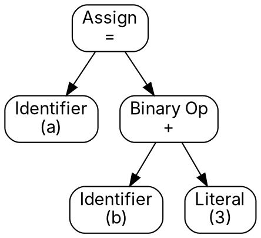

:title: Virtual Machine
:description: What is a virtual machine and how to build one? How to build a VM-based programming language?
:year: 2025
:month: 8
:day: 11
:pinned: true
:code: true
:dot: true

Virtual machines are a truely fascinating piece of software, and yet suprisingly simple. As you start understanding how they work and write your own, it will feel like you're discovering computers all over again. In this article I will explain what a virtual machine is and how to bulid one, we will write some code that runs on our virtual machine, and see how simple constructs build up to create complex logic.

# Preamble

Your computer has a processor, or CPU (central processing unit), which is responsible for executing instructions, performing calculations, moving memory around, etc. It's the central piece of your computer, and yet at its core, you can reduce it to something very simple.

> A CPU is a machine that takes **instructions** as input, and executes **actions** as output.

Those *instructions* are very basic. An instruction might add two numbers, multiply two numbers, read from a memory location, write to a memory location, etc.

When a program executes on your computer, it can go through convoluted paths involving various optimizations and pre-processing, but evenutally it **must** be transformed into instructions for the CPU to understand and execute.

> A virtual machine, VM, is a simulation of a CPU.

This simulation can be more or less complex, support more or less instructions, but the main idea stays the same.

There are multiple types of VM architectures, mainly: stack-based, register-based, or hybrid. In this article we will be playing around with a *hybrid* model.

# Programming Languages

CPUs come in various kinds and architectures (for example because of their brands). The instructions a given CPU support are not necessarily the same as other CPUs. This means that when you compile code into an executable, it has to be compiled *for a given CPU instruction set*.

Languages such as C or C++ compile directly into machine code (CPU instructions), which is why they run very fast, but it also means you have to write **one compiler per CPU architecture to target**.

Other languages, like Java, are based on virtual machines. For Java it's the **Java Virtual Machine**, or JVM. Code written in Java does not compile into CPU instructions directly, but instead it compiles into **VM instructions** (here, the JVM)! It is then the job of the JVM (which is just another piece of software) to read and execute the instructions. This means it is slower to execute since we've introduced a "middle-man" between the code and the CPU, which is the VM (the code runs on the JVM, which runs on the CPU).

In return, the advantages of this approach are multiple:

- Any system that has the VM can run your code (so you don't have to write a compiler for each CPU architecture)
- Anyone can create a new progamming language syntax and compile their code into your VM's instruction set (e.g. Scala, Kotlin, and more, run on the JVM)
- Easier to maintain, extend, and debug

# Virtual Machine

Our virtual machine will have those components:

- A **stack** which holds temporary values for calculations
- A **memory** which holds persistent values in a given scope
- A **program** which it has to run (a set of instructions)
- An **instruction pointer** which points to the current instruction in the *program* that is being executed

This will be our instruction set:

- **`push <value>`** pushes a value to the stack
- **`store <address>`** pops a value from the stack and stores it at the given address in the memory
- **`load <address>`** reads a value at the given address from the memory and pushes it onto the stack
- **`add`** pops two elements from the stack, computes the sum, and pushes the result onto the stack
- **`sub`** pops two elements from the stack, computes the difference between the second and the first, and pushes the result onto the stack
- **`jumpif <address>`** pops an element stack, and moves the instruction pointer to the given address if the value is greater than zero
- **`print`** pops an element from the stack and prints it to stdout
- **`halt`** stops the virtual machine

`value` and `address` will be **int32** (4 bytes).

Here's a starter Python code:

```python
import dataclasses

class Op:
    PUSH = 0
    STORE = 1
    LOAD = 2
    ADD = 3
    SUB = 4
    JUMPIF = 5
    PRINT = 6
    HALT = 7

@dataclasses.dataclass
class Vm:
    program: bytes
    stack: list[int]
    memory: list[int]
    ip: int = 0

    def run(self):
        while self.ip < len(self.program):
            instruction = self.program[self.ip]
            # TODO: process instruction

program = [] # instructions to execute
vm = Vm(program=program, stack=[], memory=[0] * 32)
vm.run()
```

**Challenge!** Can you complete writing the code of the virtual machine on your own?

When you do, feed in the following program to get a surprise!

```python
program = [0, 0, 0, 0, 0, 1, 0, 0, 0, 0, 0, 0, 0, 0, 1, 1, 0, 0, 0, 1, 0, 0, 0, 0, 0, 1, 0, 0, 0, 2, 2, 0, 0, 0, 0, 2, 0, 0, 0, 1, 3, 1, 0, 0, 0, 3, 2, 0, 0, 0, 3, 6, 2, 0, 0, 0, 1, 1, 0, 0, 0, 0, 2, 0, 0, 0, 3, 1, 0, 0, 0, 1, 2, 0, 0, 0, 2, 0, 0, 0, 0, 1, 3, 1, 0, 0, 0, 2, 0, 0, 0, 0, 20, 2, 0, 0, 0, 2, 4, 5, 0, 0, 0, 30, 7]
```

## Code

Here's the full code:

```python
import dataclasses

class Op:
    PUSH = 0
    STORE = 1
    LOAD = 2
    ADD = 3
    SUB = 4
    JUMPIF = 5
    PRINT = 6
    HALT = 7

@dataclasses.dataclass
class Vm:
    program: bytes
    stack: list[int]
    memory: list[int]
    ip: int = 0

    def push(self, value: int):
        self.stack.append(value)

    def store(self, index: int):
        self.memory[index] = self.stack.pop()

    def load(self, index: int):
        self.stack.append(self.memory[index])

    def add(self):
        a = self.stack.pop()
        b = self.stack.pop()
        self.stack.append(a + b)

    def sub(self):
        a = self.stack.pop()
        b = self.stack.pop()
        self.stack.append(b - a)

    def jumpif(self, pointer: int):
        if self.stack.pop() > 0:
            self.ip = pointer

    def print(self):
        print(self.stack.pop())

    def run(self):
        while self.ip < len(self.program):
            instruction = self.program[self.ip]
            self.ip += 1

            if instruction == Op.PUSH:
                self.push(self._read_int32())
            elif instruction == Op.STORE:
                self.store(self._read_int32())
            elif instruction == Op.LOAD:
                self.load(self._read_int32())
            elif instruction == Op.ADD:
                self.add()
            elif instruction == Op.SUB:
                self.sub()
            elif instruction == Op.JUMPIF:
                self.jumpif(self._read_int32())
            elif instruction == Op.PRINT:
                self.print()
            elif instruction == Op.HALT:
                break
            else:
                raise ValueError(f"Instruction not supported: {instruction}")

    def _read_int32(self) -> int:
        return self._read_int(4)

    def _read_int(self, size: int) -> int:
        data = self.program[self.ip: self.ip + size]
        self.ip += size
        return int.from_bytes(bytes(data))
```

If you run the previous program you will see... the **fibonacci** sequence! How?!

Let's understand how this works by examples. I wrote a small assembler program which allows us to write instructions using their name. Anything following a `#` is a comment.

## Example 1

In this example, we add 4 and 5 together and print the result on the screen. I have commented out the content of the stack at each step. Click the `Run` button to start the VM!

<textarea style="width: 100%; height: 200px; resize: vertical;" id="assembly1"></textarea>
<input id="execute1" type="button" value="Run">
<input id="assemble1" type="button" value="Assemble">
<div class="article-code-output" id="output1"></div>

## Example 2

I have also introduced a label mechanism in the assembler program so we don't have to pass the actual index of the instruction to `jumpif`. To define a label, write down a dot `.` followed by the name of the label, e.g. `.mylabel`. Then use it as `jumpif .mylabel`.

Can you guess what this example does?

<textarea style="width: 100%; height: 200px; resize: vertical;" id="assembly2"></textarea>
<input id="execute2" type="button" value="Run">
<input id="assemble2" type="button" value="Assemble">
<div class="article-code-output" id="output2"></div>

## Fibonacci

Earlier, I simply translated the following logic into bytecode for our VM:

```python
a = 0
b = 1
n = 20

for i in range(n):
    c = a + b
    print(c)
    a = b
    b = c
```

<textarea style="width: 100%; height: 200px; resize: vertical;" id="assembly3"></textarea>
<input id="execute3" type="button" value="Run">
<input id="assemble3" type="button" value="Assemble">
<div class="article-code-output" id="output3"></div>

# Programming Constructs

As you can see, we can build up to what we have in today's programming languages using very simple instructions. In this section we will see how to build common programming constructs.

## If Condition

An `if` condition is a construct that executes a code-block **if** a certain condition is true, otherwise the program should jump to the instruction after the code-block.

```
# evaluate a condition, push the result to the stack
# stack=[...,x] with x>0 if the condition evaluated to `true`
jumpifnot .endif
# if-block...
.endif
```

Where `jumpifnot` is the opposite of `jumpif`: it will jump if the top element in the stack is `<= 0`.

## While Loop

A `while` loop is a construct that keeps executing a code-block **while** a certain condition is true. When the condition stops being true, then program should jump to the end of the code-block.

```
.while
# evaluate a condition, push the result to the stack
# stack=[...,x] with x>0 if the condition evaluated to `true`
jumpifnot .endwhile
# while-block...
jump .while
.endwhile
```

Where `jump` is an unconditional jump: it moves the instruction pointer regardless of what's in the stack.

## Functions

Functions are nothing but a section of the bytecode that we jump ***to and back***. The question is: how does the function code know where to ***jump back*** if it can be invoked from different places?

We can have a different stack for function calls in which we push the address of the caller before jumping to a function. Whenever the function ***returns***, it pops an element from the ***call stack*** and jumps to that address (so it *returns* to the caller).

```
# main program
call .myfunction
# ...
# ...
.myfunction
# function body
return
```

Where `call` pushes the current instruction pointer + 1 to the call stack, and `return` pops an element from the call stack and `jump` to it.

# More Instructions

A good exercise would be to implement those extra instructions we just mentioned. In fact, if you just want to play around, they are already implemented in the VM running in this website.

You have access to: `jump`, `jumpifnot`, `call`, `return`, `mod` (modulo), `mul` (multiply), `eq` (equal), and `neq` (not equal).

<textarea style="width: 100%; height: 200px; resize: vertical;" id="assembly4"></textarea>
<input id="execute4" type="button" value="Run">
<input id="assemble4" type="button" value="Assemble">
<div class="article-code-output" id="output4"></div>

## Prime Numbers

<textarea style="width: 100%; height: 200px; resize: vertical;" id="assembly5"></textarea>
<input id="execute5" type="button" value="Run">
<input id="assemble5" type="button" value="Assemble">
<div class="article-code-output" id="output5"></div>

# How To Build A Programming Language

Building a VM-based programming language is really not that hard once you understand those concepts. As you implement more instructions in your VM and understand how to map the high-level constructs to those instructions, what remains is how to translate code written in a high-level syntax into the low-level bytecode for your VM.

Although this deserves an entire series on its own, these are roughly the steps to take.

## 1. Tokenizer

A *tokenizer* first runs over your high-level code and builds a list of *tokens* out of it. For example:

```c
int multiply(int a, int b) {
    return a * b;
}
```

Will return tokens: `int`, `multiply`, `(`, `int`, `a`, `,`, `int`, `b`, `)`, `{`, `return`, `a`, `*`, `b`, `;`, `}`.

Note that this is not a simple split-by-space. The tokenizer will also assign a type to each token, e.g. `STRING`, `NUMBER`, `LEFT_PARENTHESIS`, `RIGHT_PARENTHESIS`, `IDENTIFIER`, etc.

## 2. Abstract Syntax Tree

The tokens from the previous step are then used to build an *Abastract Syntax Tree*, AST. The AST represents the **logic** of your code in a way that is independent from the syntax of your language. Essentially, this is a Tree structure, with `IF`-nodes, `WHILE`-nodes, and such. 

For example, this AST represents `a=b+3`.



## 3. Compiler

Lastly, a *compiler* converts the AST into bytecode for your virtual machine, which can then run the code. This is great because any person who wants to create a new language syntax for your VM only has to compile it to your AST. In fact, you could use any existing AST builder, and then convert code to your VM's bytecode.

---

A few years ago I built a toy programming language this way. Check it out!

[](https://github.com/omaraflak/banana)

<script src="/assets/virtual-machine/vm.js"></script>